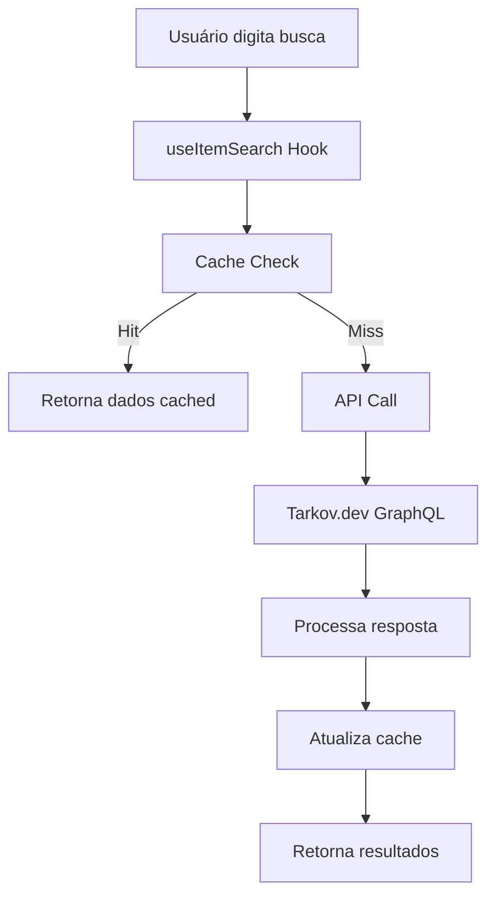
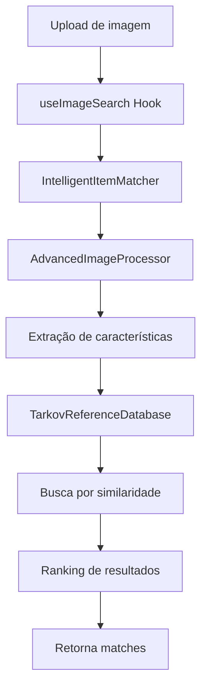
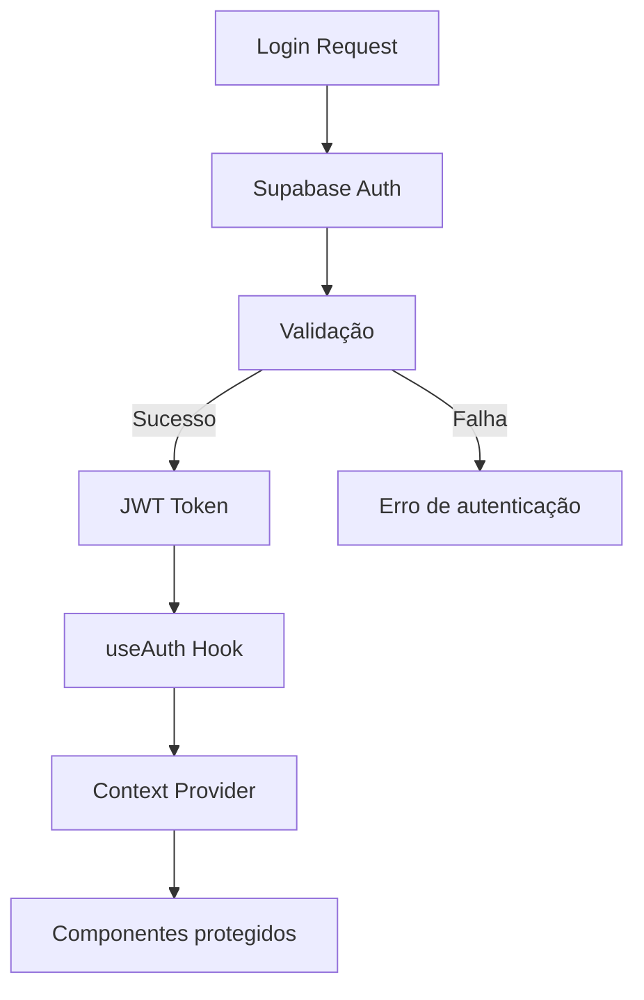

# Documentação: Arquitetura do Sistema Secret Tarkov

## Visão Geral

O Secret Tarkov é uma aplicação web moderna construída com Next.js 14, React 18 e TypeScript, focada em fornecer ferramentas avançadas para jogadores de Escape from Tarkov. O sistema utiliza uma arquitetura modular e escalável com foco em performance e experiência do usuário.

## Stack Tecnológica

### Frontend
- **Next.js 14**: Framework React com App Router
- **React 18**: Biblioteca de interface de usuário
- **TypeScript**: Tipagem estática
- **Tailwind CSS**: Framework de estilização
- **Radix UI**: Componentes acessíveis

### Backend/API
- **Next.js API Routes**: Endpoints serverless
- **Supabase**: Backend-as-a-Service
- **GraphQL**: Consultas à API do Tarkov.dev

### Processamento de Imagem
- **Canvas API**: Manipulação de imagens no browser
- **Jimp**: Processamento de imagem (mock)
- **Algoritmos customizados**: Detecção e análise

### Autenticação e Dados
- **Supabase Auth**: Sistema de autenticação
- **PostgreSQL**: Banco de dados principal
- **Redis**: Cache (planejado)

## Estrutura de Diretórios

```
src/
├── app/                    # App Router do Next.js
│   ├── api/               # API Routes
│   │   └── search/        # Endpoints de busca
│   ├── item/              # Páginas de itens
│   ├── search/            # Página de busca
│   ├── layout.tsx         # Layout principal
│   └── page.tsx           # Página inicial
├── components/            # Componentes React
│   ├── layout/           # Componentes de layout
│   ├── providers/        # Context providers
│   └── ui/               # Componentes de UI
├── hooks/                # Custom hooks
├── lib/                  # Bibliotecas e utilitários
├── types/                # Definições de tipos TypeScript
└── documentacao/         # Documentação técnica
```

## Componentes Principais

### 1. Sistema de Autenticação

**Arquivos**: `src/lib/auth.ts`, `src/hooks/useAuth.ts`

**Funcionalidades**:
- Login/logout com Supabase
- Gerenciamento de sessão
- Proteção de rotas
- Planos de assinatura (Plus)

### 2. API de Busca

**Arquivos**: `src/lib/tarkov-api.ts`, `src/app/api/search/route.ts`

**Funcionalidades**:
- Integração com Tarkov.dev GraphQL API
- Cache inteligente de resultados
- Filtros avançados de busca
- Paginação e ordenação

### 3. Sistema de Busca por Imagem

**Arquivos**: 
- `src/lib/intelligent-item-matcher.ts`
- `src/lib/advanced-image-processing.ts`
- `src/hooks/useImageSearch.ts`

**Funcionalidades**:
- Upload e processamento de imagens
- Detecção automática de itens
- Seleção manual de regiões
- Algoritmos de correspondência

### 4. Base de Dados de Referência

**Arquivos**: `src/lib/tarkov-reference-database.ts`

**Funcionalidades**:
- Armazenamento de itens de referência
- Busca por similaridade
- Indexação otimizada
- Cache de características

### 5. Sistema de Cache

**Arquivos**: `src/hooks/useSearchCache.ts`

**Funcionalidades**:
- Cache de buscas de texto
- Cache de resultados de imagem
- Estratégias de expiração
- Persistência local

## Fluxo de Dados

### 1. Busca por Texto


### 2. Busca por Imagem


### 3. Autenticação


## Padrões de Desenvolvimento

### 1. Custom Hooks
Todos os estados complexos e lógica de negócio são encapsulados em custom hooks:
- `useAuth`: Gerenciamento de autenticação
- `useImageSearch`: Busca por imagem
- `useTarkov`: Operações da API do Tarkov
- `useSearchCache`: Sistema de cache
- `useWatchlist`: Lista de favoritos

### 2. Context Providers
Estados globais são gerenciados através de Context API:
- `AuthProvider`: Estado de autenticação
- `ThemeProvider`: Tema da aplicação
- `ToastProvider`: Notificações

### 3. Componentes Compostos
Componentes de UI seguem padrão de composição:
```typescript
<Card>
  <CardHeader>
    <CardTitle>Título</CardTitle>
  </CardHeader>
  <CardContent>
    Conteúdo
  </CardContent>
</Card>
```

### 4. Tipagem Forte
Todos os dados são tipados com TypeScript:
- `types/tarkov.ts`: Tipos relacionados ao jogo
- `types/api.ts`: Tipos de API
- `types/database.ts`: Tipos do banco de dados
- `types/user.ts`: Tipos de usuário

## Performance e Otimizações

### 1. Code Splitting
- Lazy loading de componentes pesados
- Dynamic imports para funcionalidades opcionais
- Separação de bundles por rota

### 2. Cache Strategies
- **Browser Cache**: Para assets estáticos
- **Memory Cache**: Para dados de sessão
- **Local Storage**: Para preferências do usuário
- **API Cache**: Para resultados de busca

### 3. Image Optimization
- Redimensionamento automático
- Lazy loading de imagens
- WebP quando suportado
- Placeholder blur

### 4. Database Optimization
- Índices otimizados
- Queries eficientes
- Connection pooling
- Read replicas (planejado)

## Segurança

### 1. Autenticação
- JWT tokens com expiração
- Refresh token rotation
- Rate limiting
- CSRF protection

### 2. Autorização
- Role-based access control
- Resource-level permissions
- API key validation
- Input sanitization

### 3. Data Protection
- Encryption at rest
- HTTPS everywhere
- Secure headers
- Privacy compliance

## Monitoramento e Observabilidade

### 1. Logging
- Structured logging
- Error tracking
- Performance metrics
- User analytics

### 2. Monitoring
- Application performance
- Database performance
- API response times
- Error rates

### 3. Alerting
- Critical error alerts
- Performance degradation
- Security incidents
- Capacity planning

## Deployment e DevOps

### 1. Environment Setup
- **Development**: Local com hot reload
- **Staging**: Preview deployments
- **Production**: Optimized builds

### 2. CI/CD Pipeline
- Automated testing
- Code quality checks
- Security scanning
- Automated deployment

### 3. Infrastructure
- **Hosting**: Vercel/Netlify
- **Database**: Supabase PostgreSQL
- **CDN**: Global content delivery
- **Monitoring**: Real-time metrics

## Escalabilidade

### 1. Horizontal Scaling
- Stateless application design
- Load balancer ready
- Database read replicas
- CDN distribution

### 2. Vertical Scaling
- Efficient algorithms
- Memory optimization
- CPU utilization
- Storage optimization

### 3. Microservices Ready
- Modular architecture
- API-first design
- Service boundaries
- Event-driven communication

## Testing Strategy

### 1. Unit Tests
- Component testing
- Hook testing
- Utility function testing
- Algorithm validation

### 2. Integration Tests
- API endpoint testing
- Database integration
- Authentication flow
- Image processing pipeline

### 3. E2E Tests
- User journey testing
- Cross-browser compatibility
- Performance testing
- Accessibility testing

## Roadmap Técnico

### Próximas Implementações
1. **Redis Cache**: Cache distribuído
2. **WebSockets**: Real-time updates
3. **PWA**: Progressive Web App
4. **Mobile App**: React Native

### Melhorias de Performance
1. **Edge Computing**: Processamento distribuído
2. **ML Pipeline**: Machine learning integrado
3. **GraphQL Federation**: API unificada
4. **Streaming**: Real-time data streaming

### Novas Funcionalidades
1. **Social Features**: Comunidade integrada
2. **Analytics Dashboard**: Métricas avançadas
3. **API Pública**: Para desenvolvedores
4. **Marketplace**: Economia virtual

## Contribuição e Manutenção

### 1. Code Standards
- ESLint configuration
- Prettier formatting
- TypeScript strict mode
- Conventional commits

### 2. Documentation
- Code comments
- API documentation
- Architecture decisions
- Deployment guides

### 3. Review Process
- Pull request templates
- Code review checklist
- Automated testing
- Security review

## Conclusão

A arquitetura do Secret Tarkov foi projetada para ser moderna, escalável e maintível. Com foco em performance, segurança e experiência do usuário, o sistema está preparado para crescer e evoluir conforme as necessidades dos jogadores de Escape from Tarkov.

Para informações específicas sobre implementações, consulte as documentações individuais de cada módulo na pasta `documentacao/`.