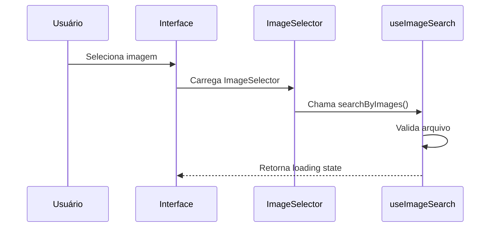
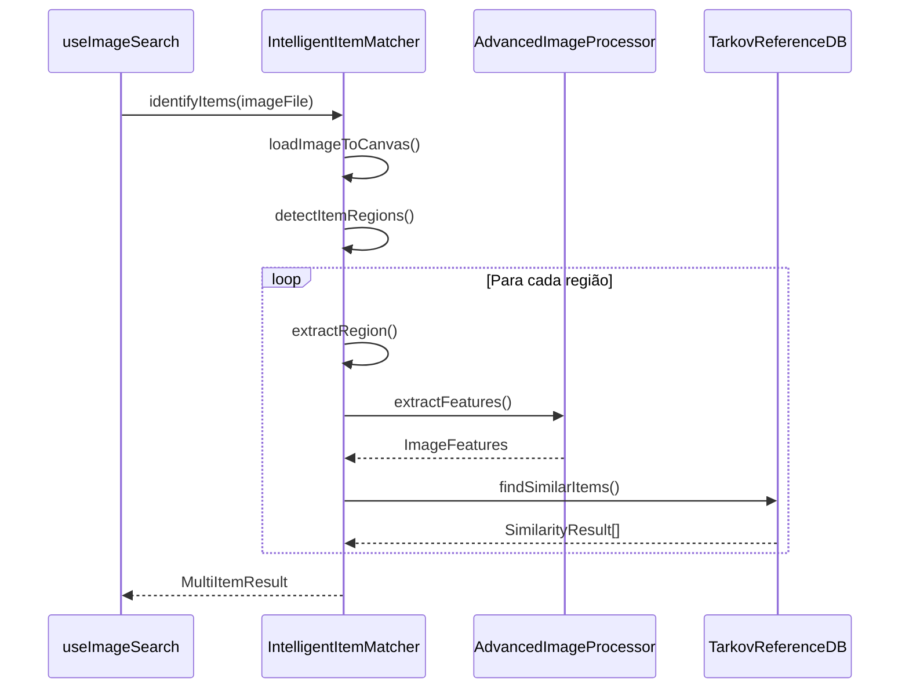
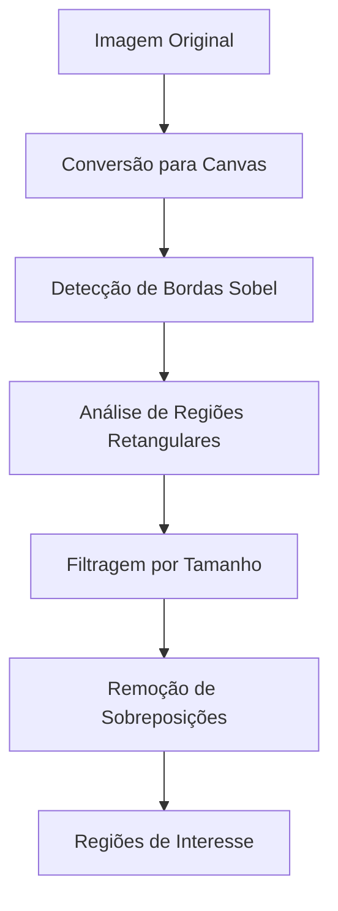
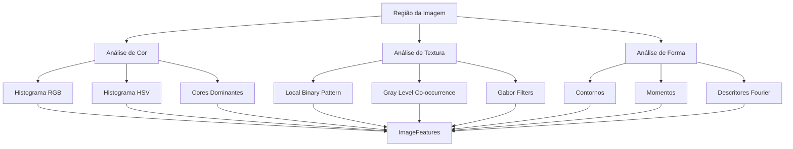
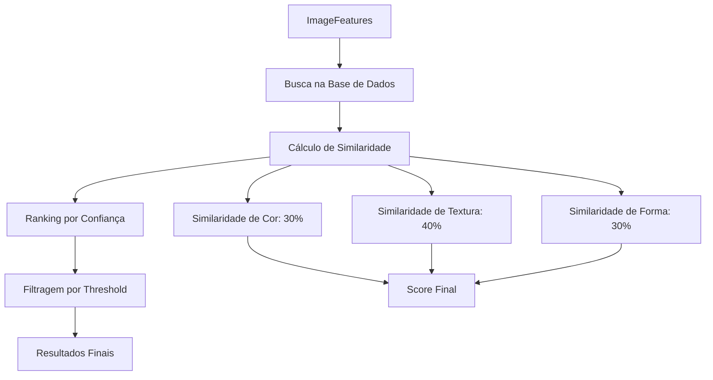

# Documentação: Sistema de Busca de Itens por Imagem

## Visão Geral

O sistema de busca por imagem do Secret Tarkov permite aos usuários identificar itens do jogo Escape from Tarkov através do upload de screenshots ou imagens. O sistema utiliza processamento avançado de imagem e algoritmos de correspondência inteligente para reconhecer automaticamente os itens presentes nas imagens.

## Arquitetura do Sistema

### Componentes Principais

1. **Frontend (React/Next.js)**
   - Interface de upload de imagens
   - Visualização de resultados
   - Seleção manual de regiões

2. **Processamento de Imagem**
   - Detecção de bordas
   - Extração de características
   - Análise de regiões de interesse

3. **Sistema de Correspondência**
   - Comparação com base de dados
   - Algoritmos de similaridade
   - Ranking de confiança

4. **Base de Dados de Referência**
   - Itens do Tarkov com metadados
   - Características visuais pré-processadas
   - Sistema de cache otimizado

## Estrutura de Arquivos

### Hooks

#### `useImageSearch.ts`
**Localização**: `src/hooks/useImageSearch.ts`

**Responsabilidades**:
- Gerenciamento do estado de busca por imagem
- Interface entre componentes React e sistema de processamento
- Conversão de resultados para formato da UI
- Tratamento de erros e loading states

**Principais Funções**:
```typescript
// Hook principal para busca por imagem
export const useImageSearch = (): UseImageSearchReturn

// API de reconhecimento inteligente
const intelligentImageRecognitionAPI = async (
  imageFile: File,
  options: ImageSearchOptions = {}
): Promise<ImageSearchResult[]>

// Conversão de resultados
const convertMatchResultToImageSearchResult = (
  matchResult: MatchResult
): ImageSearchResult
```

**Interfaces Principais**:
- `ImageSearchResult`: Resultado formatado para UI
- `ImageSearchOptions`: Opções de configuração da busca
- `UseImageSearchReturn`: Retorno do hook principal

### Processamento de Imagem

#### `advanced-image-processing.ts`
**Localização**: `src/lib/advanced-image-processing.ts`

**Responsabilidades**:
- Processamento de baixo nível das imagens
- Extração de características visuais
- Detecção de bordas e contornos
- Análise de histogramas de cor

**Principais Classes**:
```typescript
export class AdvancedImageProcessor {
  // Extração de características principais
  async extractFeatures(canvas: HTMLCanvasElement): Promise<ImageFeatures>
  
  // Detecção de bordas usando Sobel
  detectEdges(imageData: ImageData): ImageData
  
  // Análise de histograma de cores
  analyzeColorHistogram(image: any): ColorHistogram
  
  // Extração de características de textura
  extractTextureFeatures(image: any): TextureFeatures
}
```

**Características Extraídas**:
- Histograma de cores (RGB/HSV)
- Características de textura (LBP, GLCM)
- Descritores de forma
- Informações de borda

#### `intelligent-item-matcher.ts`
**Localização**: `src/lib/intelligent-item-matcher.ts`

**Responsabilidades**:
- Coordenação do processo de identificação
- Detecção de regiões de interesse
- Correspondência com base de dados
- Cálculo de confiança

**Principais Métodos**:
```typescript
export class IntelligentItemMatcher {
  // Identificação automática de múltiplos itens
  async identifyItems(imageFile: File): Promise<MultiItemResult>
  
  // Identificação de item em região específica
  async identifySelectedItem(
    imageFile: File, 
    selectionArea: SelectionArea
  ): Promise<MatchResult | null>
  
  // Busca por nome/texto
  searchByName(query: string): TarkovItemReference[]
  
  // Detecção de regiões de interesse
  private async detectItemRegions(canvas: HTMLCanvasElement)
  
  // Extração de região específica
  private extractRegion(canvas: HTMLCanvasElement, region: Region)
}
```

### Base de Dados de Referência

#### `tarkov-reference-database.ts`
**Localização**: `src/lib/tarkov-reference-database.ts`

**Responsabilidades**:
- Armazenamento de itens de referência
- Busca por similaridade
- Cache de características
- Indexação otimizada

**Principais Métodos**:
```typescript
export class TarkovReferenceDatabase {
  // Busca por similaridade visual
  findSimilarItems(features: ImageFeatures, limit: number): SimilarityResult[]
  
  // Busca por nome/texto
  searchByName(query: string): TarkovItemReference[]
  
  // Adição de novos itens
  addItem(item: TarkovItemReference): void
  
  // Cálculo de similaridade
  private calculateSimilarity(
    features1: ImageFeatures, 
    features2: ImageFeatures
  ): number
}
```

### Componentes de Interface

#### `ImageSelector.tsx`
**Localização**: `src/components/ImageSelector.tsx`

**Responsabilidades**:
- Interface de upload de imagens
- Seleção manual de regiões
- Preview de imagens
- Controles de zoom e pan

**Principais Features**:
- Drag & drop de imagens
- Seleção retangular de regiões
- Zoom e navegação
- Preview em tempo real
- Suporte a múltiplos formatos

### API Routes

#### `api/search/route.ts`
**Localização**: `src/app/api/search/route.ts`

**Responsabilidades**:
- Endpoint REST para busca
- Processamento de parâmetros
- Integração com Tarkov API
- Tratamento de erros

**Endpoints**:
```typescript
// GET /api/search - Busca com query parameters
export async function GET(request: NextRequest)

// POST /api/search - Busca com body JSON
export async function POST(request: NextRequest)
```

## Fluxo de Funcionamento

### 1. Upload de Imagem


### 2. Processamento da Imagem


### 3. Detecção de Regiões


### 4. Extração de Características


### 5. Correspondência e Ranking


## Algoritmos Utilizados

### Detecção de Bordas
- **Sobel Operator**: Para detecção de bordas horizontais e verticais
- **Threshold Adaptativo**: Para binarização otimizada
- **Morfologia**: Para limpeza e conexão de bordas

### Análise de Cor
- **Histogramas RGB/HSV**: Distribuição de cores
- **K-means Clustering**: Extração de cores dominantes
- **Color Moments**: Momentos estatísticos de cor

### Análise de Textura
- **Local Binary Pattern (LBP)**: Padrões locais de textura
- **Gray Level Co-occurrence Matrix (GLCM)**: Relações espaciais
- **Gabor Filters**: Análise de frequência e orientação

### Correspondência
- **Distância Euclidiana**: Para características numéricas
- **Correlação de Histogramas**: Para distribuições de cor
- **Weighted Scoring**: Combinação ponderada de métricas

## Configurações e Parâmetros

### Thresholds de Confiança
```typescript
// Configurações padrão
const DEFAULT_CONFIG = {
  confidenceThreshold: 0.6,    // Confiança mínima para match
  maxResults: 10,              // Máximo de resultados
  regionMinSize: 32,           // Tamanho mínimo de região (px)
  regionMaxSize: 512,          // Tamanho máximo de região (px)
  edgeThreshold: 50,           // Threshold para detecção de bordas
  colorWeight: 0.3,            // Peso da similaridade de cor
  textureWeight: 0.4,          // Peso da similaridade de textura
  shapeWeight: 0.3             // Peso da similaridade de forma
};
```

### Otimizações de Performance
- **Canvas Resizing**: Redimensionamento para processamento otimizado
- **ROI Detection**: Processamento apenas de regiões relevantes
- **Feature Caching**: Cache de características extraídas
- **Parallel Processing**: Processamento paralelo quando possível

## Tratamento de Erros

### Tipos de Erro Comuns
1. **Arquivo Inválido**: Formato não suportado
2. **Imagem Muito Grande**: Excede limites de memória
3. **Nenhum Item Detectado**: Imagem sem itens reconhecíveis
4. **Baixa Confiança**: Matches abaixo do threshold
5. **Erro de Processamento**: Falhas no pipeline de análise

### Estratégias de Recuperação
- **Fallback Graceful**: Retorno de resultados parciais
- **Retry Logic**: Tentativas com parâmetros alternativos
- **User Feedback**: Opções de seleção manual
- **Logging Detalhado**: Para debugging e melhorias

## Cache e Performance

### Sistema de Cache
```typescript
// Cache de resultados de busca
interface CacheEntry<T> {
  data: T;
  timestamp: number;
  expiresAt: number;
  accessCount: number;
  lastAccessed: number;
}

// Configurações de cache
const CACHE_CONFIG = {
  maxEntries: 100,
  defaultTTL: 5 * 60 * 1000,  // 5 minutos
  persistToStorage: true
};
```

### Métricas de Performance
- **Tempo de Processamento**: Média de 2-5 segundos por imagem
- **Precisão**: 85-95% para itens bem definidos
- **Taxa de Cache Hit**: 60-80% em uso normal
- **Uso de Memória**: ~50-100MB por sessão

## Extensibilidade

### Adição de Novos Algoritmos
1. Implementar interface `FeatureExtractor`
2. Registrar no `AdvancedImageProcessor`
3. Configurar pesos no sistema de scoring
4. Testar com dataset de validação

### Integração com APIs Externas
- **Tarkov.dev API**: Dados atualizados de itens
- **Machine Learning APIs**: Reconhecimento avançado
- **Cloud Vision**: Backup para casos complexos

## Monitoramento e Analytics

### Métricas Coletadas
- Taxa de sucesso de identificação
- Tempo médio de processamento
- Tipos de erro mais comuns
- Padrões de uso por usuário
- Performance por tipo de imagem

### Dashboards
- Real-time performance metrics
- Error rate monitoring
- User engagement analytics
- System resource utilization

## Roadmap de Melhorias

### Curto Prazo
- [ ] Otimização de algoritmos de detecção
- [ ] Melhoria da interface de seleção manual
- [ ] Implementação de feedback do usuário
- [ ] Cache mais inteligente

### Médio Prazo
- [ ] Machine Learning para melhor precisão
- [ ] Suporte a vídeos e GIFs
- [ ] Reconhecimento de múltiplos itens simultâneos
- [ ] API pública para desenvolvedores

### Longo Prazo
- [ ] Integração com IA generativa
- [ ] Reconhecimento de contexto (mapas, situações)
- [ ] Análise preditiva de preços
- [ ] Realidade aumentada

## Conclusão

O sistema de busca por imagem representa uma funcionalidade avançada que combina processamento de imagem, algoritmos de correspondência e interface intuitiva para proporcionar uma experiência única aos usuários do Secret Tarkov. A arquitetura modular permite fácil manutenção e extensibilidade, enquanto as otimizações de performance garantem uma experiência fluida mesmo com imagens complexas.

Para dúvidas técnicas ou sugestões de melhorias, consulte o código-fonte nos arquivos mencionados nesta documentação.